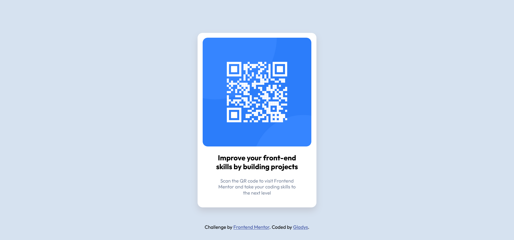

# Frontend Mentor - QR code component solution

This is a solution to the [QR code component challenge on Frontend Mentor](https://www.frontendmentor.io/challenges/qr-code-component-iux_sIO_H). Frontend Mentor challenges help you improve your coding skills by building realistic projects. 

## Table of contents

- [Overview](#overview)
  - [Screenshot](#screenshot)
  - [Links](#links)
- [My process](#my-process)
  - [Built with](#built-with)
  - [What I learned](#what-i-learned)
  - [Continued development](#continued-development)
  - [Useful resources](#useful-resources)
- [Author](#author)

## Overview

### Screenshot

Browser used: Firefox

### Links

- Live Site URL: (https://qr-code-component-main-iota-peach.vercel.app/)

## My process

### Built with

- Semantic HTML5 markup
- CSS
- Simple flexbox property
- My hands
- Constant Googling

### What I learned
This is my first time participating in FrontEnd Mentor. I guess there's none much to learn (other than being able to solve the issue in which the footer has to stick all the way below in mobile phones). I look forward to participate when I am ready.

### Continued development
I hope I can build it using TailWind CSS.

### Useful resources

- [Example resource 1](https://stackoverflow.com/questions/25241593/sticky-footer-not-totaly-in-the-bottom-on-a-mobile-device) - The `position:absolute` helped me solve the issue I mentioned in What I learned section.

## Author

- GitHub - [Gladys](https://github.com/linggladys)
- Frontend Mentor - [@linggladys](https://www.frontendmentor.io/profile/linggladys)

